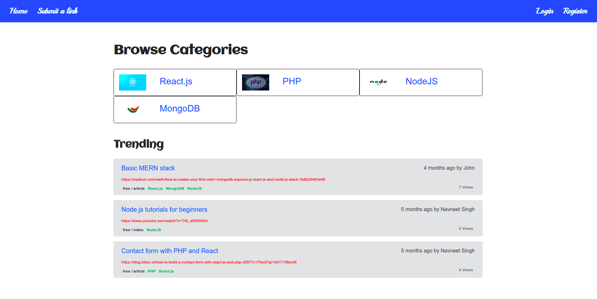
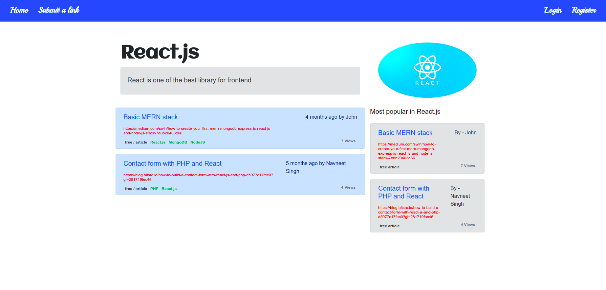
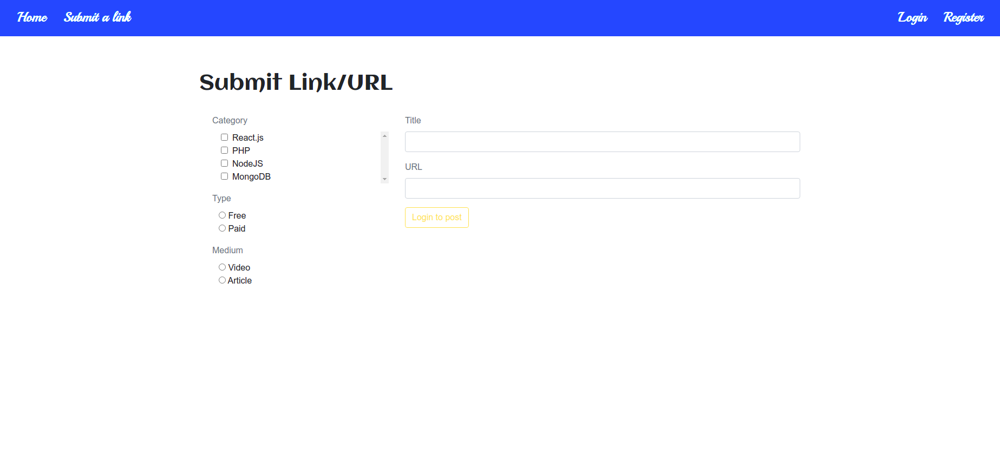
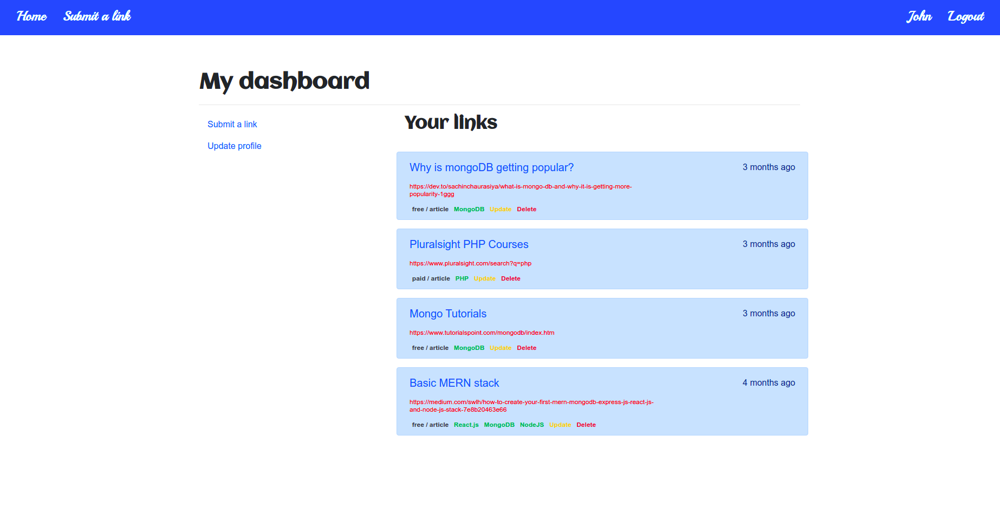
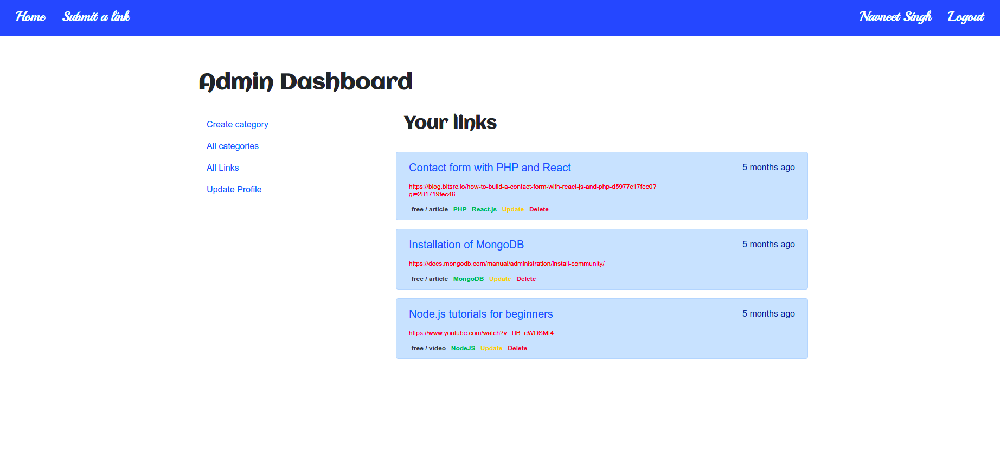

[](https://badges.pufler.dev) [](https://badges.pufler.dev) [](https://badges.pufler.dev)

# :eyes: [Hybrid Tech](http://ec2-13-233-84-81.ap-south-1.compute.amazonaws.com/)

[](https://forthebadge.com) [](https://forthebadge.com) [](https://forthebadge.com) [](https://forthebadge.com)

## Table of Contents

- [About the Project](#about-the-project)
  - [Built With](#built-with)
- [Getting Started](#getting-started)
  - [Prerequisites](#prerequisites)
  - [Installation](#installation)
- [Libraries & Frameworks](#libraries--frameworks)
- [Features](#features)
- [Screenshots](#screenshots)
- [Found a bug? Missing a specific feature?](#issues)
- [Contributing](#contributing)
- [License](#license)

## About the Project

Hybrid Tech is a bookmarker application built to keep track of links/courses for various topics and technologies separately integrated with AWS for storage(S3), email(SES) implementing personalized & mass email features, IAM and hosted on EC2 <br  />

Users can browse through a variety of trending topics and submit links to share articles or videos and have access to all the CRUD functionalities for the submitted links

### Built With

- MERN + NextJS + AWS Deployment

[Back to Table of Contents](#table-of-contents)

## Getting Started

### Prerequisites

- NextJS
- NodeJS

### Installation

- Server dependencies

1. Install project dependencies

```bash
  yarn install or npm install
```

2. Add environment variables in your `.env`

```env
  DATABASE_CLOUD=
  PORT=
  CLIENT_URL=
  AWS_ACCESS_KEY_ID=
  AWS_SECRET_ACCESS_KEY=
  AWS_REGION=
  EMAIL_FROM=
  EMAIL_TO=
  JWT_SECRET=
  JWT_ACCOUNT_ACTIVATION=
  JWT_RESET_PASSWORD=
```

- Client dependencies

1. Install project dependencies

```bash
  yarn install or npm install
```

2. Define public runtime configurations in your `next.config.js`

```env
  APP_NAME=
  API=
  PRODUCTION=
  DOMAIN=
  FB_APP_ID=
```

3. Start the development server

```bash
  yarn dev or npm run dev
```

[Back to Table of Contents](#table-of-contents)

## Libraries & Frameworks

| Name                                | Description                                                  |
| ----------------------------------- | ------------------------------------------------------------ |
| [NextJS](https://nextjs.org/)       | The React Framework for Production                           |
| [ReactJS](https://reactjs.org/)     | A JavaScript library for building user interfaces            |
| [NodeJS](https://nodejs.org/en/)    | An open source server environment that uses JS on the server |
| [Mongoose](https://mongoosejs.com/) | Elegant mongodb object modeling for node.js                  |

## Features

- JWT based Authentication
- User login, register, account activation, forgot and reset password
- Implementing rich text editor
- Infinite scroll
- CRUD on user, links and categories
- AWS S3 for uploading files
- Mongo atlas as a managed database in the cloud
- Mass emailing
- Resizing images client side
- AWS EC2 for hosting the application in the cloud

[Back to Table of Contents](#table-of-contents)

## Screenshots







## Issues

Feel free to **file a new issue** with a respective title and description on the [Hybrid Tech Server](https://github.com/Navneet-Singh-123/Hybrid-Tech-Server) repository. If you already found a solution to your problem, **I would love to review your pull request**!

## Contributing

First of all, thank you for being interested in helping out, your time is always appreciated in every way. :100:
Here's some tips:

- Check the [issues page](https://github.com/Navneet-Singh-123/Hybrid-Tech-Server/issues) for already opened issues (or maybe even closed ones) that might already address your question/bug/feature request.
- Feature requests are welcomed! Provide some details on why it would be helpful for you and others, explain how you're using bull-board and if possible even some screenshots if you are willing to mock something!
  Check out the [contributing](./CONTRIBUTING.md) page to see the best places to file issues, start discussions and begin contributing.

## :closed_book: License

Licensed under the [MIT License](LICENSE)

Made with love by [Navneet Singh](https://github.com/Navneet-Singh-123) 🚀
